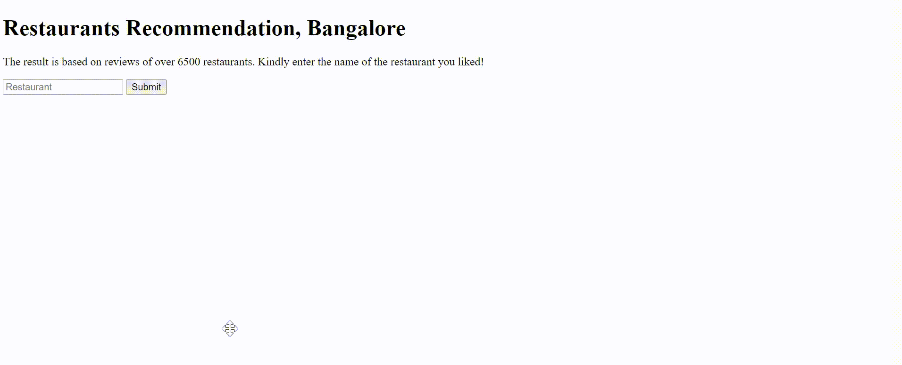

# Restaurant-Recommendor

Recommending new Restaurants based on one you liked for Bangalore. This application recommends you restaurants based on the similarity in reviews by people. The dataset used is from Zomato which can be found [here](https://www.kaggle.com/himanshupoddar/zomato-bangalore-restaurants). 

__Check out the live version of this app [here](https://glacial-bastion-35496.herokuapp.com/).__

## About 

### Project Overview

Building Recommendation System is a very common use case in industries. Giving good recommendations can help a company increase its revenue and provide a better customer experience. In this case, I have built a simple application which will help people find restaurants of their choice in Bangalore.

I am using TF-IDF to process the reviews of customers. The model recommends on the basis of cosine similarity between two reviews and ranks them on the basis of restaurant rating.

These are the major components to this project:

* removing unneccessary columns and cleaning the columns to make it uniform across all rows
* removing punctuation, stopwords from reviews column and vectorizing it using TF-IDF
* calculating the cosine similarities between the reviews, and outputting restaurants in descending order of cosine similarities
* creating a flask app and deploying the application on a webserver

## Input Data

Dataset used is from zomato. Each row is a review from the user, the dataset contains 51700 rows.

I have given a description of its columns below:

|#| Column | Type | Description |
| --- | --- | --- | --- |
| 1 | url | string | url for the restaurant on zomato|
| 2 | address | string | full address |
| 3 | name | string | name of the restaurant |
| 4 | online_order | string | Does the restaurant accept online orders? yes or no|
| 5 | book_table | string | Can you book a table here? yes or no |
| 6 | rate | string | Rating of the restaurant out of 5 |
| 7 | votes | string | Number of votes |
| 8 | phone | string | Contact number |
| 9 | location | string | Area in bangalore where the restaurant is located, eg : 'Koramangala' |
| 10 | rest_type | string | Type of restaurant |
| 11 | dish_liked | string | The dishes that are liked : eg-Masala Dosa |
| 12 | cuisines | string | Cuisine |
| 13 | approx_cost(for two people) | string | Approx cost |
| 14 | reviews_list | string| Review of a user|
| 15 | menu_item | string | List of items in menu |
| 16 | listed_in(type) | string | Type of service eg; Buffet|
| 17 | listed_in(city) | string | Location in Bangalore |


## Repository Structure and Description:


```
- app
| - templates
| |- home.html # home-page template

|- run.py  # Flask application
|- errors.py # Handle Exception
|- cosine.py # compute cosine similarity without memory outage
|- procfile # to deploy flask on heroku
- demo
|- gif.gif # animation with live app usage
- README.md
- Restaurant_Recommender_System.ipynb # Python 3 notebook, which contains notebook version of the program
- requirements.txt # Dependencies of this application
```
## Demo


## Conclusion & Improvement

I have used TF-IDF to form vectors from reviews and and then the recommendations are generated on the basis of their cosine similarity. The reviews are taken from 6500 unique restaurants in Bangalore.


Some improvements that can be made are :

* Using word embeddings like word2vec for generating feature vectors
* using transformer based models like BERT
* Using a largeer dataset one that contains several reviews for every restaurant. In this dataset there are few restaurants that have only one review.


